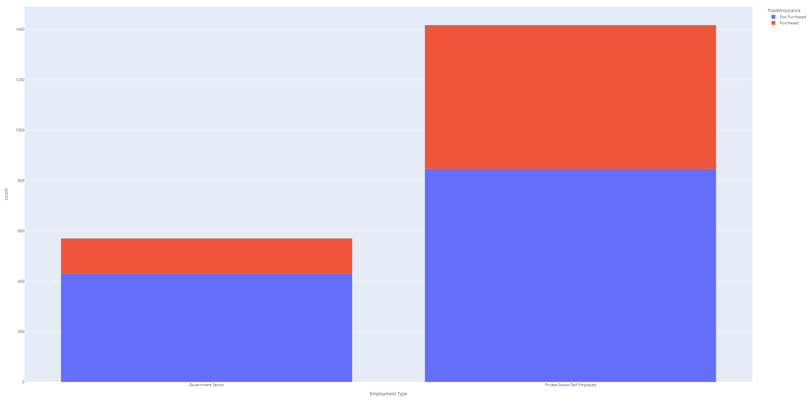

# Nick Portfolio
Data Projects

# [Project 1: Travel Insurance Prediction](https://github.com/nbapproved/Predicting-Travel-Insurance)
* Created models to predict whether or not people would buy travel insurance based on personal information
* Created a Decision Tree Classifier with about 81% accuracy
* Used Random Search and Grid Search to find best hyperparameters for a Random Forest Classifier
* Random Forest Classifier had about 85% accuracy

# [Project 2: Neural Net for Prediction](https://github.com/nbapproved/neural-net-project)
* Created neural network that can classify objects between 2 different sets of pictures
* Pictures collected from Google Images
* Used about 3.7 million trainable parameters to train the model in about 60 seconds
* Achieved 100% accuracy (based on limited validation and testing data)
